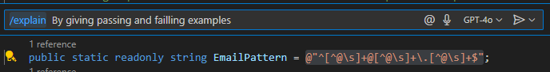
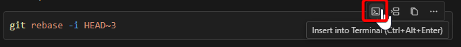
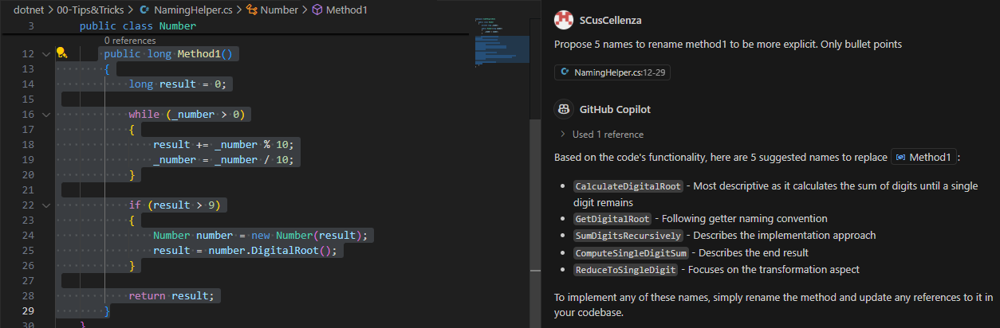

# Copilot Tips and Tricks

## 1. RegEx Helper
Position your cursor over any regex pattern and:
- Type "Explain this pattern:" above it
- Use `/explain` command in prompt
- Ask Copilot to apply modifications : restrict mail to a certain domain, phone numbers to a country ...

Example:
```csharp
// Explain this pattern:
@"^[^@\s]+@[^@\s]+\.[^@\s]+$"
```


## 2. Command Line Magic
Ask Copilot to help with:

### Docker/Git
```bash
# Create dockerfile for .NET 6 app
# Set up postgres + pgAdmin in docker-compose
# Squash last 3 commits
```

### Cloud/DB
```bash
# Create Azure Web App with custom config
# PostgreSQL backup specific tables
# MongoDB export with query filter
```
Tips:
- Write descriptive promps
- Let Copilot suggest commands
- Always review before execution
- Use shortcut in VS code to insert into terminal


## 3. Naming Helper

Use Copilot to help you to rename variable, methods, classes or files :


